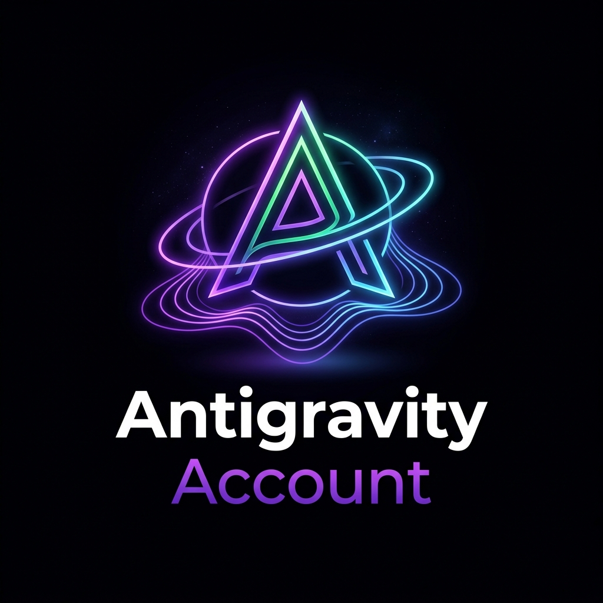

# 🌌 Antigravity Account

  

  <b>The definitive multi-account manager for Antigravity IDE — switch sessions, track live model quotas, and auto-rotate with one click.</b>

  
  
  
  

---

**Antigravity Account** is the definitive multi-account manager built exclusively for **Antigravity IDE** (and Antigravity 2.0). It provides seamless, one-click session switching, live quota tracking across all Google AI & Claude models, intelligent renewal-aware sorting, customizable themes, and automated rotation when quotas run low.

---

## ✨ Key Features

- 🎨 **Multi-Theme Visual System:** Choose between **Dark Purple (Original)**, **Midnight Black (OLED Pure)**, **Deep Ocean Blue**, or **VS Code Adaptive Theme** directly in settings.
- 👤 **Seamless Multi-Account Switching:** Connect multiple Google / Antigravity accounts and switch active sessions in one click without manually logging out or re-authenticating.
- ⏱️ **Intelligent Renewal Sorting:** Accounts are organized intelligently:
  1. Active pinned account at the top.
  2. Accounts with available quota (> 0%) ordered by highest remaining quota first.
  3. Depleted accounts (0%) ordered by **closest renewal countdown** (accounts that recharge soonest appear first).
  4. Inactive/expired accounts cleanly organized at the bottom.
- 📊 **Real-Time Model Quotas & Next-Gen AI Models:** Live monitor credits and model limits for **Gemini 3.7 Flash**, **Claude Sonnet 4.6**, **Claude Opus 4.6**, **Gemini 3.5 Flash**, **Gemini 3.1 Pro**, and **GPT-OSS 120B**, with a discreet header counter displaying accounts with remaining balance (e.g., `50/78`).
- ⚡ **Targeted Segment Scanning:** Scan all accounts, only accounts with available quota, or only accounts needing renewal. Live progress bar persists seamlessly across view changes.
- 🔄 **Smart Auto-Rotation:** Automatically cycle to the next account with available quota when your current session runs out of balance.
- 🔔 **Desktop Balance Alerts:** Receive native desktop notifications when model balances fall below your configured threshold.
- 🔐 **Password-Encrypted Backups:** Safely export and import all registered accounts and device profiles with AES-256-GCM encryption.
- 🌍 **Full Multilingual Localization (10 Languages):** Native interface support for English, Español, 中文 (简体), Português (Brasil), Français, Deutsch, 日本語, Русский, 한국어, and العربية (with bidirectional RTL support).
- 🛡️ **Anti-Ban & Anti-Correlation:** Randomized device profiles (`storage.json` & `state.vscdb`) and human-like request throttling (3–7s delays) to prevent API rate-limiting or account cross-correlation.

---

## 🚀 Requirements & Quick Start

1. **Antigravity IDE:** Antigravity `v1.23.2` or Antigravity `2.0+`.
2. Open the **Antigravity Account** icon in the Activity Bar.
3. Click **Add Account** to authorize via OAuth in your browser.
4. Click **Activate** on any account to immediately switch your IDE session.

---

## ⚠️ Best Practices & Account Limits

> [!WARNING]
> **Recommended Maximum Pool Size (~75–78 Accounts):**
> Due to Google's automated anti-abuse heuristics and security triggers, creating or operating more than **78 accounts** on a single machine or network environment can trigger automatic account suspensions or verification blocks on newly created accounts.
> For long-term stability and security, we strongly recommend keeping your pool within **70 to 78 active accounts**.

---

## 🔒 Privacy & Local Security

> [!IMPORTANT]
> **100% Local Operations:** Your authentication tokens and account data are stored strictly on your local machine. No credentials, tokens, or telemetry data are ever collected, transmitted, or hosted on third-party servers. All communications go directly from your local machine to Google's official endpoints.

---

## 🤝 Community & Support

- 🐛 **Issue Tracker:** [GitHub Issues](https://github.com/Davissss2/AntigravityAccounts/issues)
- 📦 **Source Repository:** [GitHub](https://github.com/Davissss2/AntigravityAccounts)
- 📝 **Release Notes:** [CHANGELOG.md](CHANGELOG.md)
